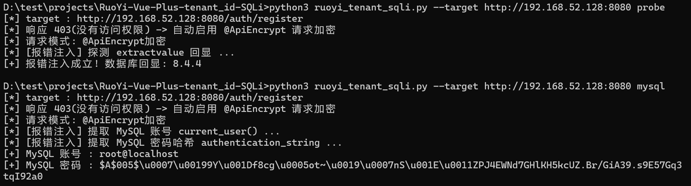

# RuoYi‑Vue‑Plus tenant_id SQL 注入漏洞（XVE‑2026‑50962）

针对 **RuoYi-Vue-Plus 5.x** 多租户 `tenant_id` 前台 SQL 注入漏洞的复现脚本

## 漏洞概述

| 事项 | 说明 |
|---|---|
| 漏洞类型 | 前台 SQL 注入 |
| 触发入口 | `POST /auth/register` 请求体 `tenantId` 字段 |
| 根因 | `PlusTenantLineHandler.getTenantId()` 使用 `new StringValue(tenantId)` 将外部可控租户 ID 未做处理直接拼入 SQL
| 影响 | 无需登录、无需验证码，绕过多租户隔离，可读取/篡改全库数据 |
| 复现环境 | RuoYi-Vue-Plus-v5.5.0 + Windows |

相关分析报告：

[多租户 tenant_id SQL 注入漏洞分析与应急响应报告](https://mp.weixin.qq.com/s/r0hNmUFo4MsQcZR1OeRfEg)

[RuoYi-Vue-Plus SQL注入漏洞(XVE-2026-50962)](https://mp.weixin.qq.com/s/iWwhEC3HFsk3_y7cHjrkOA)

## 修复建议
1. 对参数 tenant_id 做校验
2. 修改 application.yml 中默认的公钥和私钥

## 复现过程

```bash
pip install requests pycryptodome

# 探测注入是否存在
python3 ruoyi_tenant_sqli.py --target http://<TARGET_IP>:8080 probe

# 获取 MySQL 账号与密码哈希
python3 ruoyi_tenant_sqli.py --target http://<TARGET_IP>:8080 mysql

# 使用代理
python3 ruoyi_tenant_sqli.py --target http://<TARGET_IP>:8080 --proxy http://127.0.0.1:8080 probe
```


> `--proxy` 等全局参数必须放在子命令 `probe` / `mysql` **之前**。

## 免责声明

本工具仅用于**授权的**安全测试、漏洞研究与应急响应。使用者需确保对目标拥有合法测试授权，因滥用造成的后果与作者无关。
